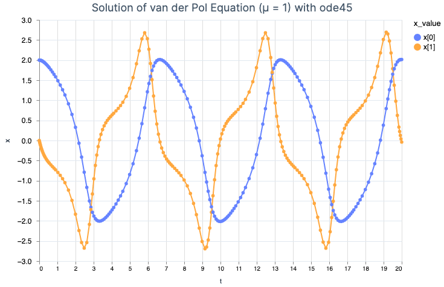

# Integrator

A numerical integrator written in Elixir for the solution of sets of non-stiff ordinary differential
equations (ODEs). 

## Installation

The package can be installed by adding `integrator` to your list of dependencies in `mix.exs`:

```elixir
def deps do
  [
    {:integrator, "~> 0.1"},
  ]
end
```

The docs can be found at <https://hexdocs.pm/integrator>.

## Description

Two integrator options are available; the first, `Integrator.RungeKutta.DormandPrince45`, is an 
adaptation of the [Octave ode45](https://octave.sourceforge.io/octave/function/ode45.html) and [Matlab
ode45](https://www.mathworks.com/help/matlab/ref/ode45.html). The `DormandPrince45` integrator utilizes the
[Dormand-Prince](https://en.wikipedia.org/wiki/Dormand%E2%80%93Prince_method) 4th/5th order Runge
Kutta algorithm.

The 2nd available integrator, `Integrator.RungeKutta.BogackiShampine23`, is an adaptation of the [Octave
ode23](https://octave.sourceforge.io/octave/function/ode23.html) and [Matlab
ode23](https://www.mathworks.com/help/matlab/ref/ode23.html) The `BogackiShampine23` integrator uses the
[Bogacki-Shampine](https://en.wikipedia.org/wiki/Bogacki%E2%80%93Shampine_method) 3rd order Runge
Kutta algorithm.

Both `DormandPrince45` (which is the default integrator option) and `BogackiShampine23` utilize an 
adaptive stepsize algorithm for computing the integration time step.  The time step is computed based on the
satisfaction of a required error tolerance.

This library heavily leverages [Elixir Nx](https://github.com/elixir-nx/nx); many thanks to the
[creators of `Nx`](https://github.com/elixir-nx/nx/graphs/contributors), as without it this library
would not have been possible. The [GNU Octave code](https://github.com/gnu-octave/octave) was also
used heavily for inspiration and was used to generate numerical test cases for the Elixir versions
of the algorithms.  Many thanks to [John W. Eaton](https://jweaton.org/) for his tremendous work on
Octave. `Integrator` has been tested extensively during its development, and has a large and growing
test suite.

## Usage

See the Livebook guides for detailed examples of usage. As a simple example, you can integrate the
Van der Pol equation as defined in `Integrator.SampleEqns.van_der_pol_fn/2` from time 0 to 20 with an
intial x value of `[0, 1]` via:

```elixir
t_initial = 0.0
t_final = 20.0
x_initial = Nx.tensor([0.0, 1.0])
solution = Integrator.integrate(&SampleEqns.van_der_pol_fn/2, t_initial, t_final, x_initial)
```

You'll need to set up a means to capture the data output via an output function; see the Livebook guides for 
details.



Options exist for:
- outputting simulation results dynamically via an output function (for applications
such as plotting dynamically, or for animating while the simulation is underway)
- generating simulation output at fixed times (such as at `t = 0.1, 0.2, 0.3`, etc.)
- interpolating intermediate points via quartic Hermite interpolation (for `DormandPrince45`) or via cubic
Hermite interpolation (for `BogackiShampine23`) 
- detecting termination events (such as collisions); see the Livebook guides for details.
- increasing the simulation fidelity (at the expense of simulation time) via absolute tolerance and
  relative tolerance settings


## So why should I care??? A tool to solve ODEs? Why would I need this?

The basic gist of the project is that it is a tool in Elixir (that leverages [Nx](https://github.com/elixir-nx)) 
to numerically solve sets of ordinary differential equations, or ODEs.  Science and engineering 
problems typically generate either sets of ODEs or partial differential equations (PDEs). So basically 
`integrator` lets you solve any scientific or engineering problem which generates ODEs, which is an
extremely class of problems (finite element methods are frequently used to solve sets of PDEs).

Fun fact: hundreds (or even thousands) of scientific problems had been formulated in the form of ODEs 
since the time that Isaac Newton first invented calculus in the 1600's, but these problems remained 
intractable & unsolvable for over three centuries other than a very small handful that were amenable 
to closed form solutions; that is, the ODEs could be solved analytically (i.e., via mathematical 
manipulation). So there was this tragic dilemma; we could formulate these problems mathematically 
since the 1600's - 1800's, but couldn't actually solve them. 

So one of the primary drivers to create the first digital computers in the 1940's - 1960's was 
to solve ODEs. The space program, for example, would have been impossible without the numerical 
solution of ODEs which represented the space flight trajectories, attitude, & control.  And before 
the first digital computers, analog computers were used to solve ODEs back in the 1920's - 1940's.

So believe it or not, the first computers were developed and used to solve ODEs, not play League of 
Legends. :wink:

These algorithms are battle-tested and in some cases have been around for decades; Matlab and Octave 
are just relatively clean implementations of some of these algorithms that were used as the basis
for the Elixir implentations.
